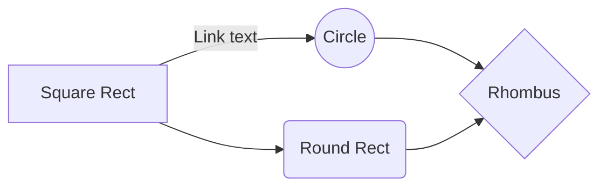

# Mermaid Example: Basic Flowchart

## Objetivo

Este archivo sirve para probar un flowchart corto y facil de leer.

## Notas

- Bueno para validar preview simple
- Bueno para probar `Shift+M` en salida terminal
- Volver al [indice Mermaid](00-INDEX.md)

