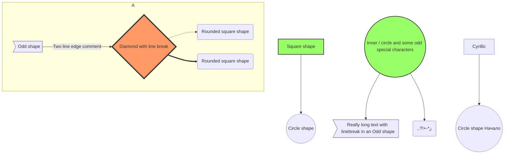

# Mermaid Example: Styled Flowchart

## Objetivo

Este ejemplo empuja un poco mas el renderer con labels largos, subgraph y estilos.

## Notas

- Bueno para probar fallback en preview
- Bueno para probar web link en Mermaid mas complejo
- Volver al [indice Mermaid](00-INDEX.md)

