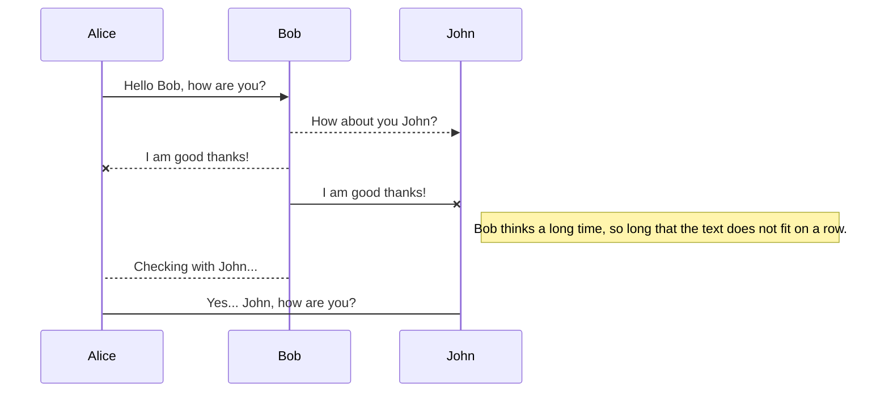

# Mermaid Example: Sequence Diagram

## Objetivo

Este ejemplo sirve para validar otro tipo de diagrama distinto de flowchart.

## Notas

- Bueno para validar como cae el preview cuando no es un flowchart
- Bueno para probar salida HTML o web
- Volver al [indice Mermaid](00-INDEX.md)

