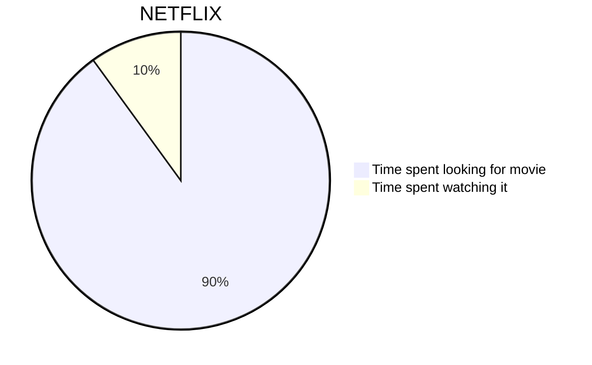

# Mermaid Example: Pie Chart

## Objetivo

Este ejemplo prueba un caso corto y distinto, ideal para HTML o web link.

## Notas

- Ideal para probar que no todo Mermaid es flujo
- Bueno para validar apertura en navegador
- Volver al [indice Mermaid](00-INDEX.md)

