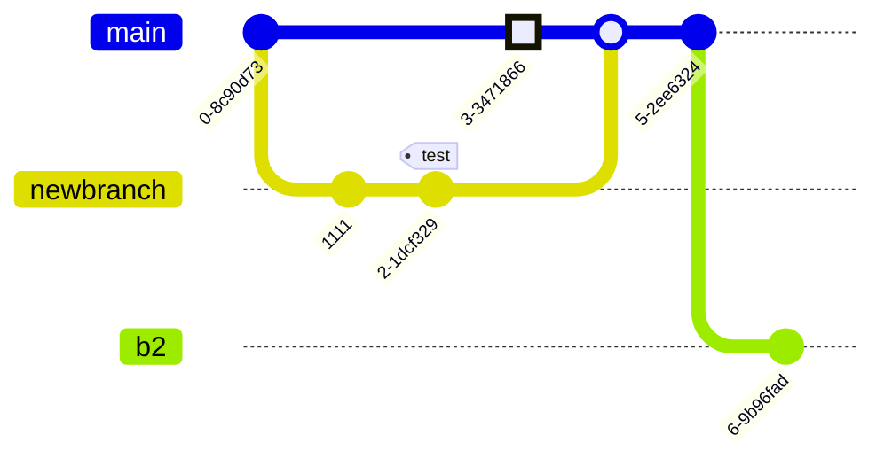

# Mermaid Example: Git Graph

## Objetivo

Este ejemplo sirve para probar una visual mas estructurada.

## Notas

- Ideal para salida HTML o web link
- Bueno para ver como responde la deteccion de Mermaid con otra sintaxis
- Volver al [indice Mermaid](00-INDEX.md)

